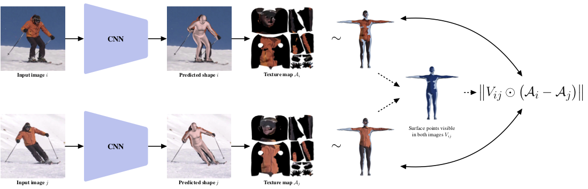

# TexturePose: Supervising Human Mesh Estimation with Texture Consistency
## [Georgios Pavlakos](https://www.seas.upenn.edu/~pavlakos/)\*, [Nikos Kolotouros](https://www.seas.upenn.edu/~nkolot/)\*, [Kostas Daniilidis](http://www.cis.upenn.edu/~kostas/) 
[[paper](https://arxiv.org/pdf/1910.11322.pdf)] [[project page](https://www.seas.upenn.edu/~pavlakos/projects/texturepose/)]



This is the code repository for the paper **TexturePose: Supervising Human Mesh Estimation with Texture Consistency**.

## Installation instructions
To run our code, we suggest using the [docker image](https://hub.docker.com/r/chaneyk/texturepose) we provide that has all the dependencies compiled and preinstalled.
Alternatively you can create a virtual environment and install all the relevant dependencies as follows (only compatible with Python 2, because of the [MPI-Mesh](https://github.com/MPI-IS/mesh) depndency)

```
virtualenv texturepose
source texpose/bin/activate
pip install -U pip
pip install -r requirements.txt
```

After finishing with the installation, you can continue with running the demo/evaluation/training code.
In case you want to evaluate our approach on Human3.6M, you also need to manually install the [pycdf package of the spacepy library](https://pythonhosted.org/SpacePy/pycdf.html) to process some of the original files. If you face difficulties with the installation, you can find more elaborate instructions [here](https://stackoverflow.com/questions/37232008/how-read-common-data-formatcdf-in-python).

## Fetch data
We provide a script to fetch the necessary data for evaluation. You need to run:
```
./fetch_data.sh
```

Besides these files, you also need to download the *SMPL* model. You will need the [neutral model](http://smplify.is.tue.mpg.de) for training and running the demo code, while the [male and female models](http://smpl.is.tue.mpg.de) will be necessary for evaluation on the 3DPW dataset. Please go to the websites for the corresponding projects and register to get access to the downloads section. In case you need to convert the models to remove the chumpy dependency, please follow the instructions [here](https://github.com/vchoutas/smplx/tree/master/tools).

## Run demo code
To run our method, you need a bounding box around the person. The person needs to be centered inside the bounding box and the bounding box should be relatively tight. You can either supply the bounding box directly or provide an [OpenPose](https://github.com/CMU-Perceptual-Computing-Lab/openpose) detection file. In the latter case we infer the bounding box from the detections.

In summary, we provide 3 different ways to use our demo code and models:
1. Provide only an input image (using ```--img```), in which case it is assumed that it is already cropped with the person centered in the image.
2. Provide an input image as before, together with the OpenPose detection .json (using ```--openpose```). Our code will use the detections to compute the bounding box and crop the image.
3. Provide an image and a bounding box (using ```--bbox```). The expected format for the json file can be seen in ```examples/im1010_bbox.json```.

Example with OpenPose detection .json
```
python demo.py --checkpoint=data/texturepose_checkpoint.pth --img=examples/im1025.jpg --openpose=examples/im1025_openpose.json
```
Example with predefined Bounding Box
```
python demo.py --checkpoint=data/texturepose_checkpoint.pth --img=examples/im1025.jpg --bbox=examples/im1025_bbox.json
```
Example with cropped and centered image
```
python demo.py --checkpoint=data/texturepose_checkpoint.pth --img=examples/im1025.jpg
```

Running the previous command will save the results in ```examples/im1025_{shape,shape_side}.png```. The file  ```im1025_shape.png``` shows the overlayed reconstruction of the model on the image.  We also render a side view, saved in ```im1025_shape_side.png```.

## Run evaluation code
Besides the demo code, we also provide code to evaluate our models on the datasets we employ for our empirical evaluation. Before continuing, please make sure that you follow the [details for data preprocessing](datasets/preprocess/README.md).

Example usage:
```
python eval.py --checkpoint=data/texturepose_checkpoint.pth --dataset=h36m-p1 --log_freq=20
```
Running the above command will compute the MPJPE and Reconstruction Error on the Human3.6M dataset (Protocol I). The ```--dataset``` option can take different values based on the type of evaluation you want to perform:
1. Human3.6M Protocol 1 ```--dataset=h36m-p1```
2. Human3.6M Protocol 2 ```--dataset=h36m-p2```
3. 3DPW ```--dataset=3dpw```
4. LSP ```--dataset=lsp```

You can also save the results (predicted SMPL parameters, camera and 3D pose) in a .npz file using ```--result=out.npz```.

## Citing
If you find this code useful for your research or the use data generated by our method, please consider citing the following paper:

	@Inproceedings{pavlakos2019texturepose,
	  Title          = {TexturePose: Supervising Human Mesh Estimation with Texture Consistency},
	  Author         = {Pavlakos, Georgios and Kolotouros, Nikos and Daniilidis, Kostas},
	  Booktitle      = {ICCV},
	  Year           = {2019}
	}
